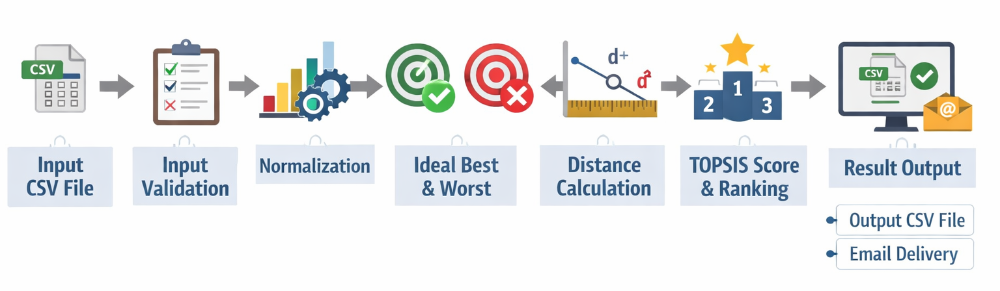
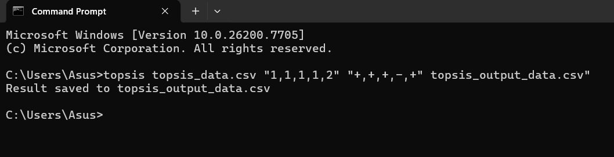
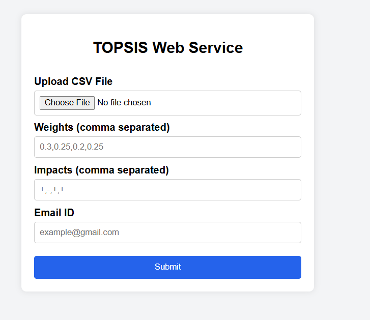
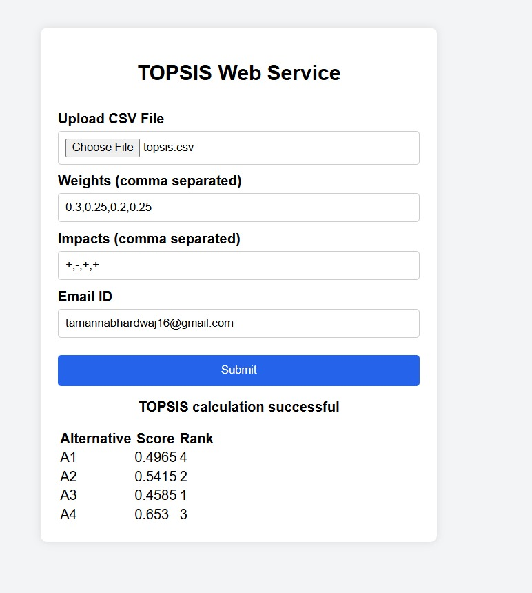

# **Title: Implementation of TOPSIS as a Python Package and Web Service**

by: Yatin Arora [102303935]
---

## **1. Methodology**

<p align="center">
  
</p>

**Workflow:**

Input CSV File → Validation of Inputs → Normalization → Weighted Normalization  
→ Ideal Best & Worst Calculation → Distance Measures → TOPSIS Score  
→ Ranking → Output CSV / Email Delivery

---

## **2. Dataset Description**

The input dataset used for this assignment is a **CSV file provided by the user**.

### Dataset Characteristics:
- **Format:** CSV
- **First Column:** Alternatives
- **Remaining Columns:** Numerical criteria values
- **Minimum Columns Required:** 3

### Parameters:
- **Weights:** User-defined, comma-separated numeric values  
- **Impacts:** User-defined, comma-separated symbols (`+` or `-`)
- **Roll Number:** **102303935**

---

## **3. Part-I: Command Line Implementation**

In Part-I, the TOPSIS algorithm was implemented as a **command-line Python program**.

### Usage:
```bash
python topsis.py data.csv "1,1,1,2" "+,+,-,+" result.csv
```
<p align="center">
  
</p>
---

## **4. Part-II: Python Package**

In Part-II, a python package was developed and uploaded on pypi.com.
the package can be accessed at:

🔗 https://pypi.org/project/topsis-yatin-102303935/

### Installation
The package can be installed from PyPI using `pip`:

```bash
pip install topsis-yatin-102303935
```


## **5. Part-III: Web Service for Topsis**

In Part-III, a **web-based TOPSIS service** was developed using the **Flask framework** to make the algorithm accessible through a graphical user interface.

The web application allows users to execute the TOPSIS algorithm **without using the command line** by providing inputs through a simple web form.

### Web Interface – Input Page

<p align="center">
  
</p>

The user is required to provide:
- Input CSV file containing alternatives and criteria
- Weights (comma-separated numeric values)
- Impacts (comma-separated `+` or `-`)
- A valid email ID

### Input Validation
The web service performs the following validations:
- Number of weights must be equal to the number of impacts
- Impacts must be either `+` or `-`
- The uploaded CSV file must contain at least three columns
- Criteria columns must contain numeric values only
- Email ID must follow a valid format

### Web Interface – Output Delivery

<p align="center">
  
</p>

After successful execution:
- The TOPSIS algorithm is executed using the packaged Python module
- A result CSV file containing **Topsis Score** and **Rank** is generated
- The result file is automatically sent to the user via email

This web service improves usability by enabling **non-technical users** to apply the TOPSIS method through a browser-based interface.


